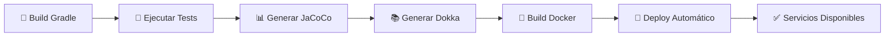

# 🏪 API REST - Sistema de Gestión Empresarial

<div align="center">


**API REST moderna y escalable para la gestión integral de usuarios, productos, categorías y pedidos**

[🚀 Características](#-características) • [📖 Documentación](#-documentación) • [🐳 Docker](#-despliegue-con-docker) • [👥 Equipo](#-equipo-de-desarrollo)

</div>

---

## 📋 Tabla de Contenidos

- [Características](#-características)
- [Tecnologías](#️-stack-tecnológico)
- [Requisitos Previos](#-requisitos-previos)
- [Instalación](#-instalación-y-configuración)
- [Despliegue con Docker](#-despliegue-con-docker)
- [Servicios Web Automáticos](#-servicios-web-automáticos)
- [Endpoints de la API](#-endpoints-de-la-api)
- [Testing](#-testing)
- [Estructura del Proyecto](#️-estructura-del-proyecto)
- [Equipo de Desarrollo](#-equipo-de-desarrollo)

---

## 🚀 Características

<table>
<tr>
<td width="50%">

### 🔐 Gestión de Usuarios
- Autenticación y autorización
- CRUD completo
- Gestión de perfiles
- Roles y permisos

</td>
<td width="50%">

### 📦 Gestión de Productos
- Catálogo completo
- Control de inventario
- Imágenes y multimedia
- Búsqueda avanzada

</td>
</tr>
<tr>
<td width="50%">

### 🏷️ Gestión de Categorías
- Organización jerárquica
- Clasificación inteligente
- Filtros personalizados
- Subcategorías

</td>
<td width="50%">

### 🛒 Gestión de Pedidos
- Carrito de compras
- Tracking de pedidos
- Historial completo
- Estados de pedido

</td>
</tr>
</table>

### ✨ Características Adicionales

- 🔄 **Despliegue Automático**: Docker Compose con un solo comando
- 📊 **Reportes en Tiempo Real**: Cobertura de código con JaCoCo
- 📚 **Documentación Automática**: Generada con Dokka
- 🧪 **Página de Testing**: Interfaz web para pruebas sin Postman
- 🎯 **API RESTful**: Siguiendo las mejores prácticas
- 🔒 **Seguridad**: Implementación de Spring Security
- ⚡ **Alto Rendimiento**: Optimizado para producción

---

## 🛠️ Stack Tecnológico

```
┌─────────────────────────────────────────────────────┐
│                                                     │
│  ☕ Java 25        🔧 Gradle 9.1    🐳 Docker      │
│                                                     │
│  📊 JaCoCo         📖 Dokka         🌐 Spring      │
│                                                     │
└─────────────────────────────────────────────────────┘
```

| Tecnología | Versión | Propósito |
|-----------|---------|-----------|
| **Java** | 25 | Lenguaje principal |
| **Gradle** | 9.1 | Gestión de dependencias y build |
| **Docker** | Latest | Contenerización y despliegue |
| **JaCoCo** | Latest | Cobertura de código |
| **Dokka** | Latest | Documentación automática |
| **Spring Boot** | Latest | Framework backend |

---

## 📋 Requisitos Previos

Antes de comenzar, asegúrate de tener instalado:

- ☕ **Java 25** o superior
- 🔧 **Gradle 9.1**
- 🐳 **Docker** y **Docker Compose**
- 📦 **Git**

### Verificar instalación

```bash
java --version    # Debe mostrar Java 25
gradle --version  # Debe mostrar Gradle 9.1
docker --version  # Verificar Docker
git --version     # Verificar Git
```

---

## 🔧 Instalación y Configuración

### 1️⃣ Clonar el repositorio

```bash
git clone <url-del-repositorio>
cd <nombre-del-proyecto>
```

### 2️⃣ Compilar el proyecto

```bash
./gradlew clean build
```

### 3️⃣ Ejecutar tests

```bash
./gradlew test
```

### 4️⃣ Generar reporte de cobertura

```bash
./gradlew jacocoTestReport
```

📊 **Reporte disponible en**: `build/reports/jacoco/test/html/index.html`

### 5️⃣ Generar documentación

```bash
./gradlew dokkaHtml
```

📚 **Documentación disponible en**: `build/dokka/html/index.html`

---

## 🐳 Despliegue con Docker

### 🚀 Inicio Rápido

```bash
# Construir y levantar todos los servicios
docker-compose up -d

# Ver logs en tiempo real
docker-compose logs -f

# Detener servicios
docker-compose down
```

### 🔨 Construcción manual

```bash
# Construir imagen
docker build -t api-gestion:latest .

# Ejecutar contenedor
docker run -d -p 8080:8080 --name api-gestion api-gestion:latest
```

### 📡 Servicios Disponibles

Una vez desplegado, accede a:

| Servicio | URL | Descripción |
|----------|-----|-------------|
| 🌐 **API Principal** | `http://localhost:8080/api` | Endpoints REST |
| 🧪 **Testing** | `http://localhost:8080/test` | Página de pruebas |
| 📊 **Reportes** | `http://localhost:8080/reports` | Cobertura JaCoCo |
| 📚 **Documentación** | `http://localhost:8080/doc` | Docs Dokka |

---

## 🌐 Servicios Web Automáticos

### 🧪 Página de Test

**URL**: `http://localhost:8080/test`

<details>
<summary><b>Ver características detalladas</b></summary>

#### Funcionalidades:

- ✅ **Interfaz Interactiva**: Formularios predefinidos para cada endpoint
- 🔄 **Peticiones en Tiempo Real**: Visualiza requests y responses al instante
- ✨ **Validación Automática**: Valida datos antes de enviar
- 📝 **Ejemplos Incluidos**: Datos de prueba para cada operación
- 🎯 **Testing Completo**: Prueba CRUD de usuarios, productos, categorías y pedidos
- 📊 **Códigos HTTP**: Explicación de cada código de respuesta
- 🎨 **UI Moderna**: Interfaz limpia y fácil de usar

#### Casos de uso:

```
✓ Pruebas rápidas sin Postman
✓ Demos para stakeholders
✓ Validación de integraciones
✓ QA y testing manual
```

</details>

---

### 📊 Reportes de Cobertura (JaCoCo)

**URL**: `http://localhost/reports`

<details>
<summary><b>Ver características detalladas</b></summary>

#### Contenido del Dashboard:

- 📈 **Cobertura Total**: Porcentaje global del proyecto
- 📦 **Por Paquetes**: Desglose por módulos
- 📄 **Por Clases**: Análisis clase por clase
- 🔍 **Líneas Detalladas**: Código cubierto vs no cubierto
- 🌳 **Coverage de Branches**: Cobertura de condicionales
- 📊 **Gráficos Visuales**: Representación gráfica de métricas
- 🎨 **Código Coloreado**: Highlighting de líneas testeadas
- 🔢 **Complejidad Ciclomática**: Métricas de complejidad

#### Métricas incluidas:

```
┌──────────────────────────────────┐
│ ✓ Line Coverage                  │
│ ✓ Branch Coverage                │
│ ✓ Method Coverage                │
│ ✓ Class Coverage                 │
│ ✓ Complexity Metrics             │
└──────────────────────────────────┘
```

**⚙️ Generación**: Los reportes se generan automáticamente durante el build de Docker.

</details>

---

### 📚 Documentación Técnica (Dokka)

**URL**: `http://localhost/doc`

<details>
<summary><b>Ver características detalladas</b></summary>

#### Documentación completa:

- 📖 **Todas las Clases**: Controllers, Services, Repositories, Models
- 🔍 **Métodos Detallados**: Públicos y privados
- 📝 **Parámetros**: Tipos, descripciones y ejemplos
- 🔄 **Valores de Retorno**: Qué devuelve cada método
- ⚠️ **Excepciones**: Qué errores puede lanzar
- 🗂️ **Estructura**: Organización de paquetes
- 🔗 **Relaciones**: Dependencias entre clases
- 🗃️ **Modelos de Datos**:
    - Usuario (campos, validaciones, relaciones)
    - Producto (atributos, categorías, stock)
    - Categoría (jerarquía, productos asociados)
    - Pedido (items, estados, usuario)

#### Navegación:

```
📚 Documentación
├── 👤 Usuarios
│   ├── UsuarioController
│   ├── UsuarioService
│   ├── UsuarioRepository
│   └── Usuario (Model)
├── 📦 Productos
│   ├── ProductoController
│   ├── ProductoService
│   ├── ProductoRepository
│   └── Producto (Model)
├── 🏷️ Categorías
│   └── ...
└── 🛒 Pedidos
    └── ...
```

**⚙️ Generación**: La documentación se compila automáticamente en el contenedor Docker usando Dokka.

</details>

---

## 📚 Endpoints de la API

### 👤 Usuarios

```http
GET    /usuarios          # Listar todos los usuarios
GET    /usuarios/{id}     # Obtener usuario específico
POST   /usuarios          # Crear nuevo usuario
PUT    /usuarios/{id}     # Actualizar usuario
DELETE /usuarios/{id}     # Eliminar usuario
```

<details>
<summary>Ver ejemplo de request/response</summary>

```json
// POST /usuarios
{
  "nombre": "Juan Pérez",
  "email": "juan@example.com",
  "password": "********",
  "rol": "USUARIO"
}

// Response 201 Created
{
  "id": 1,
  "nombre": "Juan Pérez",
  "email": "juan@example.com",
  "rol": "USUARIO",
  "fechaCreacion": "2025-11-12T16:57:00Z"
}
```

</details>

---

### 📦 Productos

```http
GET    /productos         # Listar todos los productos
GET    /productos/{id}    # Obtener producto específico
POST   /productos         # Crear nuevo producto
PUT    /productos/{id}    # Actualizar producto
DELETE /productos/{id}    # Eliminar producto
```

<details>
<summary>Ver ejemplo de request/response</summary>

```json
// POST /productos
{
  "nombre": "Laptop Pro",
  "descripcion": "Laptop de alto rendimiento",
  "precio": 1299.99,
  "stock": 50,
  "categoriaId": 2
}

// Response 201 Created
{
  "id": 1,
  "nombre": "Laptop Pro",
  "descripcion": "Laptop de alto rendimiento",
  "precio": 1299.99,
  "stock": 50,
  "categoria": {
    "id": 2,
    "nombre": "Electrónica"
  }
}
```

</details>

---

### 🏷️ Categorías

```http
GET    /categorias        # Listar todas las categorías
GET    /categorias/{id}   # Obtener categoría específica
POST   /categorias        # Crear nueva categoría
PUT    /categorias/{id}   # Actualizar categoría
DELETE /categorias/{id}   # Eliminar categoría
```

---

### 🛒 Pedidos

```http
GET    /pedidos           # Listar todos los pedidos
GET    /pedidos/{id}      # Obtener pedido específico
POST   /pedidos           # Crear nuevo pedido
PUT    /pedidos/{id}      # Actualizar pedido
DELETE /pedidos/{id}      # Eliminar pedido
```

<details>
<summary>Ver ejemplo de request/response</summary>

```json
// POST /api/pedidos
{
  "usuarioId": 1,
  "items": [
    {
      "productoId": 1,
      "cantidad": 2,
      "precioUnitario": 1299.99
    }
  ],
  "total": 2599.98
}

// Response 201 Created
{
  "id": 1,
  "usuario": {
    "id": 1,
    "nombre": "Juan Pérez"
  },
  "items": [...],
  "total": 2599.98,
  "estado": "PENDIENTE",
  "fecha": "2025-11-12T16:57:00Z"
}
```

</details>

---

## 🧪 Testing

### Página de Test Interactiva

La aplicación incluye una **interfaz web completa** accesible en `/test`:

#### 🎯 Características principales:

```
✓ Sin necesidad de Postman o herramientas externas
✓ Formularios intuitivos para cada endpoint
✓ Respuestas JSON formateadas y coloreadas
✓ Testing de todos los módulos (usuarios, productos, categorías, pedidos)
✓ Simulación de diferentes escenarios
✓ Validación de datos en tiempo real
✓ Historial de peticiones realizadas
```

#### 🚀 Uso:

1. Accede a `http://localhost:8080/test`
2. Selecciona el módulo a probar (Usuarios, Productos, etc.)
3. Elige la operación (GET, POST, PUT, DELETE)
4. Completa el formulario con datos de prueba
5. Envía la petición y observa la respuesta

> 💡 **Nota**: Esta página se genera y despliega **automáticamente** al ejecutar Docker, sin configuración adicional.

---

## 🏗️ Estructura del Proyecto

```
📁 proyecto-api/
│
├── 📂 src/
│   ├── 📂 main/
│   │   ├── 📂 java/com/api/gestion/
│   │   │   ├── 📂 controllers/       # Controladores REST
│   │   │   │   ├── UsuarioController.java
│   │   │   │   ├── ProductoController.java
│   │   │   │   ├── CategoriaController.java
│   │   │   │   └── PedidoController.java
│   │   │   │
│   │   │   ├── 📂 models/            # Entidades JPA
│   │   │   │   ├── Usuario.java
│   │   │   │   ├── Producto.java
│   │   │   │   ├── Categoria.java
│   │   │   │   └── Pedido.java
│   │   │   │
│   │   │   ├── 📂 services/          # Lógica de negocio
│   │   │   │   ├── UsuarioService.java
│   │   │   │   ├── ProductoService.java
│   │   │   │   ├── CategoriaService.java
│   │   │   │   └── PedidoService.java
│   │   │   │
│   │   │   ├── 📂 repositories/      # Acceso a datos
│   │   │   │   ├── UsuarioRepository.java
│   │   │   │   ├── ProductoRepository.java
│   │   │   │   ├── CategoriaRepository.java
│   │   │   │   └── PedidoRepository.java
│   │   │   │
│   │   │   ├── 📂 dto/               # Data Transfer Objects
│   │   │   ├── 📂 config/            # Configuraciones
│   │   │   ├── 📂 exceptions/        # Manejo de errores
│   │   │   └── 📂 security/          # Seguridad
│   │   │
│   │   └── 📂 resources/
│   │       ├── 📂 static/
│   │       │   ├── 📂 test/          # 🧪 Página de testing
│   │       │   ├── 📂 reports/       # 📊 Reportes JaCoCo
│   │       │   └── 📂 doc/           # 📚 Docs Dokka
│   │       │
│   │       └── application.properties
│   │
│   └── 📂 test/
│       └── 📂 java/                  # Tests unitarios e integración
│
├── 📄 build.gradle.kts               # Configuración Gradle
├── 📄 docker-compose.yml             # Orquestación Docker
├── 📄 Dockerfile                     # Imagen Docker
├── 📄 .gitignore
└── 📄 README.md                      # Este archivo
```

---

## 🔄 Workflow de Despliegue Automático



### Proceso paso a paso:

1. **🔨 Build del Proyecto**: Gradle compila el código fuente
2. **🧪 Ejecución de Tests**: Se ejecutan todos los tests unitarios e integración
3. **📊 Generación de Reportes**: JaCoCo genera reportes de cobertura
4. **📚 Generación de Documentación**: Dokka crea la documentación del código
5. **🐳 Construcción de Imagen**: Se empaqueta todo en un contenedor Docker
6. **🚀 Despliegue Automático**: Docker Compose levanta todos los servicios
7. **✅ Servicios Disponibles**: Test, Reports y Doc se sirven automáticamente

> 🎯 **Todo este proceso es completamente automático** al ejecutar: `docker-compose up -d`

---

## 👥 Equipo de Desarrollo

<table>
<tr>
<td align="center" width="25%">
<a href="https://github.com/Aragorn7372">
<br>
<b>Víctor Marín Escribano</b><br>
<sub>Full Stack Developer</sub>
</a>
</td>
<td align="center" width="25%">
<a href="https://github.com/Sggz221">
<br>
<b>Samuel Gómez</b><br>
<sub>Backend Developer</sub>
</a>
</td>
<td align="center" width="25%">
<a href="https://github.com/charlieecy">
<br>
<b>Carlos Cortés</b><br>
<sub>Backend Developer</sub>
</a>
</td>
<td align="center" width="25%">
<a href="https://github.com/AdrianHerSac">
<br>
<b>Adrián Herrero</b><br>
<sub>DevOps Engineer</sub>
</a>
</td>
</tr>
</table>

<div align="center">

**🤝 Trabajando juntos para crear soluciones excepcionales**

</div>

---

## 🤝 Contribuciones

¡Las contribuciones son bienvenidas! Sigue estos pasos:

1. 🍴 **Fork** el proyecto
2. 🌿 **Crea una rama** para tu feature
   ```bash
   git checkout -b feature/AmazingFeature
   ```
3. 💾 **Commit** tus cambios
   ```bash
   git commit -m 'Add some AmazingFeature'
   ```
4. 📤 **Push** a la rama
   ```bash
   git push origin feature/AmazingFeature
   ```
5. 🎉 **Abre un Pull Request**

### 📝 Guía de Contribución

- Sigue las convenciones de código del proyecto
- Añade tests para nuevas funcionalidades
- Actualiza la documentación si es necesario
- Asegúrate de que todos los tests pasen

---

## 📄 Licencia

```
MIT License

Copyright (c) 2025 Team API Gestión

Permission is hereby granted, free of charge, to any person obtaining a copy
of this software and associated documentation files (the "Software"), to deal
in the Software without restriction...
```

<div align="center">

**[Leer licencia completa](LICENSE.md)**

</div>

---

## 🐛 Reportar Issues

¿Encontraste un bug? ¿Tienes una sugerencia?

1. Verifica que el issue no exista ya
2. Crea un nuevo issue con una descripción detallada
3. Incluye pasos para reproducir el problema
4. Añade screenshots si es posible

---

## 📞 Contacto y Soporte

<div align="center">

### 💬 ¿Necesitas ayuda?

Para preguntas, sugerencias o soporte técnico:

📧 Email: team@apigestion.com  
💼 LinkedIn: [API Gestión Team]()  
🐦 Twitter: [@apigestion]()  
📖 Wiki: [Documentación completa]()

</div>

---

## 🎯 Roadmap

- [x] ✅ Sistema de usuarios completo
- [x] ✅ Gestión de productos y categorías
- [x] ✅ Sistema de pedidos
- [x] ✅ Despliegue automático con Docker
- [ ] 🔄 Sistema de pagos integrado
- [ ] 🔄 Notificaciones en tiempo real
- [ ] 🔄 Dashboard administrativo
- [ ] 🔄 API GraphQL
- [ ] 🔄 Soporte multi-idioma
- [ ] 🔄 App móvil

---

## 📊 Estadísticas del Proyecto

<div align="center">


</div>

---

<div align="center">

### 🌟 Si te gusta este proyecto, dale una estrella en GitHub

**Desarrollado con ☕ y ❤️ por el equipo de API Gestión**

---

© 2025 API Gestión • Todos los derechos reservados

</div>